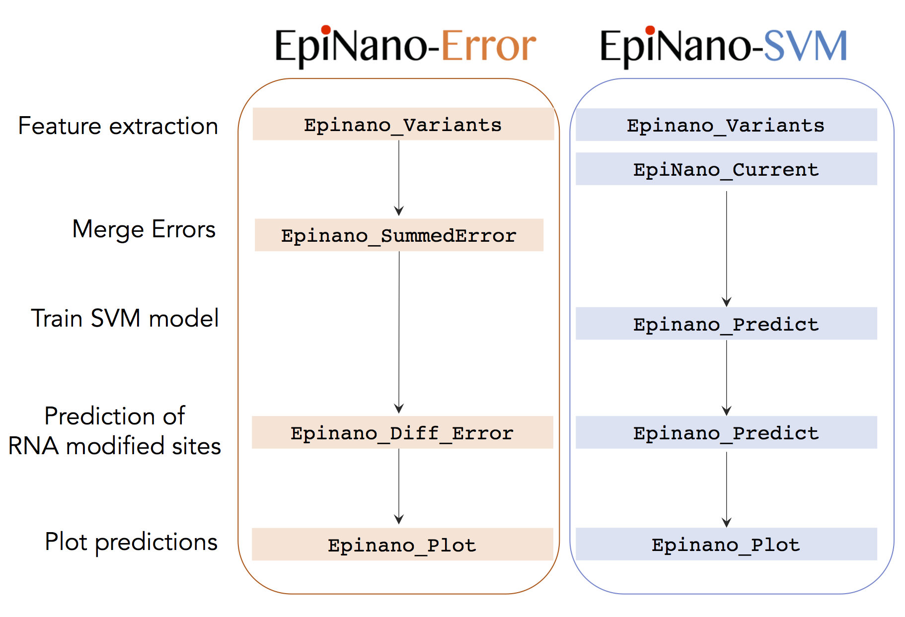

  

Detection of RNA modifications from Oxford Nanopore direct RNA sequencing reads 

##

**WE HAVE RECENTLY UPGRADED THE REPO FROM EPINANO 1.1 for 1.2 (details below)**

## Table of Contents  
- [Upgrades](#Upgrades) 
- [About EpiNano](#About-EpiNano)  
	- [Modes of Running EpiNano](#Modes-of-Running-EpiNano)  
	- [Considerations when using EpiNano](#Considerations-when-using-EpiNano)  
	- [Pre-requisites required packages](#Pre-requisites-required-packages) 
- [Getting the code](#Getting-the-code) 
- [Running EpiNano](#Running-EpiNano)
- [Further Documentation](#Further-Documentation)
- [Citing this work](#Citing-this-work) 
- [License](#License) 
- [Contact](#Contact) 

## Upgrades  

**EpiNano 1.2** - current version
* Includes pretrained m6A models derived from sequences base-called with *Guppy* v 3.1.5. 
* Pretrained models can also be used to detect other RNA modifications (tested for pseudouridine, other modifications: not tested).    
* This version of EpiNano allows to make predictions using two different strategies: *EpiNano-Error* and *EpiNano-SVM*. 
* This version now includes modules for visualizing your RNA modification predictions (*EpiNano_Plot*)



*EpiNano-Error* can only be run in pairwise mode (e.g. WT and KO or KD). It combines the different types of base-calling errors that appear in a given dataset (mismatches, deletions, insertions) as well as alterations in per-base-calling qualities. RNA modification predictions are based on the differences in error patterns observed in two matched samples. This strategy can be used with FASTQ data base-called with any given base-calling algorithm version.  

*EpiNano-SVM* can be run using either pre-trained models for a given RNA modification, or by building your own models. However, we should note that using a matched control (e.g. KO or KD) is still highly recommended, due to the noisy nature of direct RNA sequencing reads, which are 'error'-rich. Moreover, in addition to SVM models trained with "raw" base-calling 'error' features (same as in EpiNano 1.0 and 1.1), in EpiNano 1.2 we now provide SVM models trained with features that capture differences between samples (i.e. difference in mismatch, rather than absolute mismatch frequency), which we find have improved performance. 

**EpiNano 1.1** - a slimmer version of version 1.0, written in python3 is available [here](https://github.com/enovoa/EpiNano/releases).  
* This version is the one currently implemented in [MasterOfPores](https://www.frontiersin.org/articles/10.3389/fgene.2020.00211), a workflow to analyze direct RNA sequencing data. 

* The major differences with EpiNano 1.0 are (i) it is faster (ii) Uses python3 instead of python2 (iii) Does not extract current intensity in the feature table, as this feature was not used to train the final models. 

* Includes pre-trained m6A models base-called with *Albacore* version 2.1.7. 

* Works both with Guppy and Albacore basecalled data, but the SVM predictions will be only accurate if your data has been base-called using Albacore 2.1.7. 

* Regardless of the basecallers used, EpiNano can be used as a toolkit to extract per k-mer base-calling 'errors' (mismatch, insertion, deletion, quality), which are a proxy of RNA modifications present in a given dataset. We recommend running EpiNano in paired mode, i.e. computing the features in two datasets (WT-KO) to then accurately predict the RNA modified sites (i.e. those showing largest differences in their base-calling 'error' features). 

**EpiNano 1.0** - original code used in [Liu, Begik et al., Nature Comm 2019](https://www.nature.com/articles/s41467-019-11713-9), which is available [here](https://github.com/enovoa/EpiNano/releases).  

* Includes pre-trained m6A models base-called with *Albacore* version 2.1.7. 

* It extracts both base-calling 'errors' (mismatch, insertion, seletion, per-base quality) as well as current intensity values 

* Current intensity information is extracted from the base-called Albacore FAST5 files. 

* Does not have models trained with Guppy base-called datasets. 

## About EpiNano

*EpiNano* is a tool to identify RNA modifications present in direct RNA sequencing reads.  

*EpiNan*o will extract a set of 'features' from direct RNA sequencing reads, which will be in turn used to predict whether the 'error' is caused by the presence of an RNA modification or not. Features directly extracted and derived include:  

- current intensity and duration
- read quality 
- base quality scores
- mismatch frequency 
- deletion frequency 
- insertion frequency 
- sumErr 

These features can be organized in per base and per kmer formats

### Modes of Running EpiNano  
 
In EpiNano 1.2, we introduce delta-features, features capturing difference between modified and un-modified sites and sum_err, a metric computed by combining different types of errors and even base quality scores. These new metrics represent our attempt to steer around the limitation related to the fact that different types of RNA base modifications tend to introduce different types of sequencing errors. 

*EpiNano* version 1.2 can predict RNA-modified sites in two different ways:  

1. **EpiNano-Error** 
* Base-calling algorithm independent. 
* Applicable to any given RNA modification that affects the base-calling features. 

2. **EpiNano-SVM** 
* Base-calling algorithm dependent (data must be base-called with Guppy 3.1.5) 
* Can use both base-calling error features as well as current signals features 
* It can be used to train your own models as well as be applied to datasets for which a pre-trained model is available (m6A) 
* The available m6A SVM models has been trained and tested upon a set of 'unmodified' and 'modified' sequences containing m6A at known sites or A. 
* We also offer SVM models trained with delta features, i.e., features capturing difference between modified and un-modified samples. These models can be applied to detect other RNA modifications apart from m6A (tested on pseudouridine). 

### Considerations when using EpiNano  

* EpiNano relies on the use of base-calling 'errors' to detect RNA modifications; however, direct RNA sequencing base-calling produces a significant amount of 'errors' in unmodified sequences. Therefore, to obtain higher confidence m6A-modified sites, we recommend to sequence both modified and unmodified datasets (e.g. treated with demethylase, or comparing a wild-type vs knockout/knockdown). Coupling a "control" (KD/KO) is not required in earlier Epinano versions, but is highly recommended. 

* You can use EpiNano as a feature extractor to predict RNA modifications based on alterations in base-called features (i.e., **EpiNano-Error**, as used [here](https://www.biorxiv.org/content/10.1101/2020.07.06.189969v2)), as well as use the pre-trained SVMs to detect m6A RNA modifications (i.e., **EpiNano-SVM**, as used [here](https://www.nature.com/articles/s41467-019-11713-9)). 

* EpiNano does not have per-read resolution. We are currently working on an improved version of EpiNano to obtain predictions at per-read level. 

* The performance of the algorithm is dependent on the stoichiometry of the site (i.e. sites with very low stoichiometry will be often missed by the algorithm) 

* Pre-trained models to predict m6A sites are included in each release. Please note that if you use pre-trained m6A models, your data should be base-called with the SAME base-calling algorithm and version (i.e. Guppy 3.1.5 if you use EpiNano 1.2, and Albacore 2.1.7 if you use EpiNano 1.0 or 1.1). 

* If you are using a different base-calling algorithm version, we recommend you to use EpiNano-Error rather than EpiNano-SVM.

### Pre-requisites  


The following softwares and packages were used by EpiNano  

| Software/Packages | Version |  
| ------------- | ------------- |  
| java openjdk | 1.8.0 |  
| minimap2 | 2.14-r886 |  
| samtools | 0.1.19 |  
| sam2tsv | a779a30d6af485d9cd669aa3752465132cf21eec |  
| python | 3.6.7 |  
| h5py | 2.8.0 |  
| numpy | 1.15.4 |  
| pandas | 0.23.4 |  
| scikit-learn | 0.20.2 |  
| nanopolish | 0.12.4 |  
| dask | 2.5.2 |  
| biopython | 1.76 | 
| pysam | 0.15.3+ |
| R | 3.6.0 (2019-04-26) |
| R packages: | | 
| forcats | 0.4.0 |
| optparse| 1.6.6 |
| stringr | 1.4.0 |
| dplyr | 1.0.1 |    
| purrr | 0.3.2 |
| readr   | 1.3.1 |
| tidyr | 0.8.3  |
| tibble  | 3.0.3 |
| tidyverse |1.2.1 |
| ggrepel | 0.8.1 |
| car	| 3.0-3  |
| ggplot2 | 3.1.1 |
| reshape2 |1.4.3  |
| outliers | 0.14 |

## Getting the code  

To download the latest version of EpiNano , you just need to clone the repo: 

```  git clone git@github.com:enovoa/EpiNano.git ```  

You can choose to download EpiNano 1.1 [HERE](https://github.com/enovoa/EpiNano/releases)  
You can choose to download EpiNano 1.0 [HERE](https://github.com/enovoa/EpiNano/releases) 

## Running EpiNano

### a) Running EpiNano 1.2

To train models and assess prediction accuracies, please refer to commands in test_data/train_models/train_test.sh.  

To make predictions with pre-trained models, please refer to commands in /test_data/make_predictions. 

We will also update in [wiki]([https://github.com/enovoa/EpiNano/wiki/EpiNano-wiki](https://github.com/enovoa/EpiNano/wiki/EpiNano-wiki)) with specific examples of using different Epinano components.

Below is a simple introduction of programs' usage information. 

### STEP 1. Extract base-calling error features  

**Epinano_Variants**, outputs a feature table *sample.per.site.var.csv*, which contains base-calling ‘error’ information for each reference position. Please note that by default, the feature table *sample.per_site.5mer.csv* that was generated by default in EpiNano 1.1 (which contains the same base-called features organized in 5-mer windows) is not generated by default any more. If you want to generate this file, please use the script Slide_Variants.py. 
```  
python Epinano_Variants.py -h
usage: Epinano_Variants.py [-h] [-R REFERENCE] [-b BAM] [-s SAM2TSV]
                           [-n NUMBER_CPUS] [-T TYPE]

optional arguments:
  -h, --help            show this help message and exit
  -n NUMBER_CPUS, --number_cpus NUMBER_CPUS
                        number of CPUs
  -T TYPE, --type TYPE  reference types, which is either g(enome) or
                        t(ranscriptome);

Required Arguments:
  -R REFERENCE, --reference REFERENCE
                        reference file indexed with samtools faidx and with
                        sequence dictionary created using picard
                        CreateSequenceDictionary
  -b BAM, --bam BAM     bam file; if given; no need to offer reads file;
                        mapping will be skipped
  -s SAM2TSV, --sam2tsv SAM2TSV
                        /path/to/sam2tsv.jar; needed unless a sam2tsv.jar
                        produced file is already given
 
```  
The '--type' flag indicates the type of mapping, i.e., mapping to reference genome (*g*) versus mapping to referece transcriptome (*t*). If the reads were mapped to a genome reference with splicing mapping, '--type g' should be specified, and EpiNano will distinguish and process separately the reads mapped to forward and reverse strands. Otherwise, by default, the script assumes the bam file was generated by mapping the reads to reference transcriptome and the reads were only mapped to the forward strand. 

Example: 
```  
python $EPINANO_HOME/Epinano_Variants.py -n 6 -R reference.fasta -b sample.reads.bam -s  $EPINANO_HOME/misc/sam2tsv.jar --type t 
```
Note 1: it is possible to organize the variants in any kmer length using *$EPINANO_HOME/misc/Slide_Variants.py*. 

Note 2: the users should split the computations for each reference sequences if the reference genome is large. 

### STEP 2. Extract current intensity values 

This is optional. Users who are interested in exploring the electric signals including current intensities and duration time can rely on this to extract the relevant information.  User can also use the extracted features to train SVM models.

**Epinano_Current** uses [Nanopolish](https://nanopolish.readthedocs.io/en/latest/quickstart_eventalign.htmlhttps://) to extract current signal level information and then collapses it on a single position basis. 

Note 1: Please add the /path/to/nanopolish to environmental **$PATH** variable, otherwise the script will fail. 
```
$ sh Epinano_Current.sh -h

Epinano_Current.sh [-h] [-b bam -r reads -f genome/transriptome reference -d fast5dir -t threads -m bam_file_mapping_type]

        it runs nanopolish eventalign; aggreagets current intensity values associated with single positions

        nanopolish, samtools have to be installed and added to environmental paths!!

        -h [this help text]
        -b [bam file]
        -d [fast5 folder]
        -r [fastq reads file]
        -f [reference file used to produce bam file]
        -t [number of threads]
        -m [t: reads mapping performed using reference transcriptome; g: reads mapping performed with reference genome]
```

### STEP 3. Predict RNA modifications 

EpiNano offers two alternative methods to predict RNA modifications: 
i) **EpiNano-Error** uses of the variants/error frequencies computed above 
ii) **EpiNano-SVM** uses an SVM algorithm to train models and predict modifications. 

#### a) Predicting RNA modifications using EpiNano-Error:  

**Epinano_DiffErr.R** fits a linear regression model between paired unmodified and modified samples, and then detects outliers, i.e., observations with large residuals, which tend to be underlined by base modifications. 

Note 1: different types of RNA base modification show distinct biases toward the spefic types of errors. Thus, offered *Epinano_sumErr.py* to combine mismatches, indels and even quality scores. Just like the independent types of errors, the combined error is internally performed when running *Epinano_ErrDiff.R*. 
```
$ Rscript Epinano_DiffErr.R -h

Usage:
        DiffErr.R v0.1 compares a given feature between two samples. It predicts potential modified sites mainly through two methods:
                1. Compute deviance of selected featuers between samples and then calculate z-scores. Outliers or potential modified sites will then
                be determined based on user-defined threshold. Note that this is not suited for 'curlcake' data because they are highly modified (~25% of the bases 
		in the RNA molecules are modified bases).
                2. Fit a linear regression model between two samples.
                        1) detect residuals outliers of the given linear model.
                        2) compute z-scores of residuals for each observation and determine outliers using user-defined z-score threshold.
                Examples:
                        1 compare sum_err between two samples
                        Rscript Epinano_DiffErr.R -k ko.csv -w wt.csv -t 3 -o Test -c 30 -f sum_err  -d 0.1
                        2 same as above, but generate plots, one for each reference.
                        Rscript Epinano_DiffErr.R -k ko.csv -w wt.csv -t 3 -o Test -c 30 -f sum_err  -d 0.1 -p

Options:
        -c COVERAGE, --coverage=COVERAGE
                minimum coverage/depth; default: 30

        -t THRESHOLD, --threshold=THRESHOLD
                minimum z-score (i.e., number of standard deviation from mean) to determine modified sites; default: 3

        -d DEVIANCE, --deviance=DEVIANCE
                minimum deviance of selected feature between two samples; default: 0.1

        -f FEATURE, --feature=FEATURE
                the feature (column name(s) in from input file) to use to predict modifications

        -k KO_SAMPLE, --ko_sample=KO_SAMPLE
                knockout/unmodified sample

        -w WT_SAMPLE, --wt_sample=WT_SAMPLE
                wildtype/modified sample

        -o OUT_PREFIX, --out_prefix=OUT_PREFIX
                output prefix

        -p, --plot
                whether or not generate plots;  default: no plots will be generated because Epinano_Plot.R can do the job

        -h, --help
                Show this help message and exit

```


#### b) Predicting RNA modifications using EpiNano-SVM:  

EpiNano 1.2 includes pre-trained models (found in *$EPINANO_HOME/models/*), which have been trained using synthetic molecules (curlcakes) with and without introduced m6A modifications. However, the user can train their own models using **EpiNano_Predict**, employing the features generated with *EpiNano_Variants.py* and/or *EpiNano_Current.py* as shown in the previous steps.  The relevant commands can be found in *test_data/train_models/*.

```
$ python Epinano_Predict.py -h

Command:  Epinano_Predict.py -h
usage: Epinano_Predict.py [-h] [-k KERNEL] [-o OUT_PREFIX] [-a] [-M MODEL]
                          [-t TRAIN] [-mc MODIFICATION_STATUS_COLUMN] -p
                          PREDICT -cl COLUMNS

optional arguments:
  -h, --help            show this help message and exit
  -k KERNEL, --kernel KERNEL
                        kernel used for training SVM, choose any one from
                        'linear', 'poly', 'rbf', 'sigmoid'; if no choice made,
                        all 4 kernels will be used
  -o OUT_PREFIX, --out_prefix OUT_PREFIX
                        output file prefix
  -a, --accuracy_estimation
                        '-a' performs accuracy estimation with known modified
                        status from --predict file; only feasible when there
                        is prior knolwdge of modificaton status indiciated by
                        --modification_status_column
  -M MODEL, --model MODEL
                        pre-trained model that can ben used for prediction
  -t TRAIN, --train TRAIN
                        file name of feature table used for training; can be
                        gzipped
  -mc MODIFICATION_STATUS_COLUMN, --modification_status_column MODIFICATION_STATUS_COLUMN
                        column number from (input file1, i.e, traing file)
                        that contains modification status information

required arguments:
  -p PREDICT, --predict PREDICT
                        file name of feature table used for making predictions
                        or testing accuracy; can be gzipped. when this file is
                        the same the one used for training, half of the data
                        will be chosen for training.
  -cl COLUMNS, --columns COLUMNS
                        comma separated column number(s) that contain features
                        used for training and prediction

```

Example: 

```  
python $EPINANO_HOME/Epinano_Predict.py 
	--train ko_wt_combined.per_site_raw_feature.rrach.5mer.csv 
	--predict ko_wt_combined.per_site_raw_feature.rrach.5mer.csv --accuracy_estimation 
	--out_prefix train_and_test 
	--columns 8,13,23 
	--modification_status_column 26  
```  

While the user can choose to train the algorithm with one sample (--train) and test it on another independent sample (--predict), it is also possible to use the same input file both for training and testing the model, as depicted in the example above. In this scenario, Epinano_Predict will train the models with 50% of the input data, and make predictions with the remaining 50% of the data.  

In the above command, ‘--columns’ denotes the column numbers of features that are used for training models (in this case, corresponding to ‘q3’, ’mis3’ and ‘del3’), while ‘--modification_status_column’ indicates the prior knowledge of the modification statuses, i.e., the labels ‘mod’ and ‘unm’. Switching on --accuracy_estimation will report the accuracy of the trained model(s). Unless ‘--kernel’ is used, Epinano_Predict will train models with multiple kernels. 

With the trained models, the user can make predictions of modifications. 

```  
python $EPINANO_HOME/Epinano_Predict.py 
	--model q3.mis3.del3.MODEL.linear.model.dump 
	--predict some_sample.per_site.5mer.csv 
	--columns 8,13,23  
	--out_prefix some_sample.modification 
``` 

 In the command above, we employ a previously trained model ‘q3.mis3.del3.MODEL.linear.model.dump’ that will predict m6A modifications in RRACH k-mers on a dataset that is specified with ‘--predict’. Please remember to filt your dataset before or after making predicitons to keep only RRACH k-mers. 

### b) Running EpiNano 1.1

* Build feature table (on which predictions will be made)

    For step-by-step instructions to build a feature table, please take a look at the [Wiki](https://github.com/enovoa/EpiNano/wiki)

* To train SVM and perform predictions:
```
This step includes SVM training, prediction and performance assessment using single and multiple features.
$ python3 SVM.py -h

Command:  scripts/SVM.py -h
usage: SVM.py [-h] [-k KERNEL] [-o OUT_PREFIX] [-a] [-M MODEL] [-t TRAIN]
              [-mc MODIFICATION_STATUS_COLUMN] -p PREDICT -cl COLUMNS

optional arguments:
  -h, --help            show this help message and exit
  -k KERNEL, --kernel KERNEL
                        kernel used for training SVM, choose any one from
                        'linear', 'poly', 'rbf', 'sigmoid'; if no choice made,
                        all 4 kernels will be used
  -o OUT_PREFIX, --out_prefix OUT_PREFIX
                        ouput file prefix
  -a, --accuracy_estimation
                        -a perform accuracy estimation with known modified
                        status from --predict file
  -M MODEL, --model MODEL
                        pre-trained model that can ben used for prediction; if
                        this is not available SVM model will be trained and
                        dumped; there can be multiple models, which should be
                        in the same order as kernels applied
  -t TRAIN, --train TRAIN
                        file name of feature table used for training
  -mc MODIFICATION_STATUS_COLUMN, --modification_status_column MODIFICATION_STATUS_COLUMN
                        column number from (input file1, i.e, traing file)
                        that contains modification status information

required arguments:
  -p PREDICT, --predict PREDICT
                        file name of feature table used for making predictions
                        or testing accuracy. when this file is the same the
                        one used for training, half of the data will be chosen
                        for training.
  -cl COLUMNS, --columns COLUMNS
                        comma seperated column number(s) that contain features
                        used for training and prediciton

```                        

### Examples

With the example svm input files from example/svm_input folder:

* training with the example feature tables
```
	# the command below will train models using all quality scores are all positions from sample1 and make prediction on sample2
	python3 SVM.py -a -t sample1.csv -p sample2.csv -cl 1-5 -mc 11 -o test

	# while this command will do the same thing except choosing a 'linear' kernel for SVM training
	python3 SVM.py -a -k linear -cl 1-5 -t sample1.csv -p sample2.csv -mc 11

	# this 3rd command uses base quality and mismatch frequencies of the centred bases for SVM training
	python3 SVM.py -t sample1.csv -p sample2.csv -cl 3,7 -mc 11
```
* predict modifications   
```
	#use previously trained model and epinano-scripts-generated site-wise feature table to make predictions
	python3 SVM.py -a -M M6A.mis3.del3.q3.poly.dump -p test.csv -cl 7,12,22 -mc 28 -o pretrained.prediction
```


## Further Documentation 

Please check [HERE](https://github.com/novoalab/EpiNano/tree/master/test_data/train_models) for additional information on usage on **EpiNano 1.2** 

Please check the [Wiki](https://github.com/novoalab/EpiNano/wiki) for additional information on usage on **EpiNano 1.1**


## Citing this work
If you find this work useful, please cite:

Huanle Liu*, Oguzhan Begik*, MorghanC  Lucas, Jose Miguel Ramirez, Christopher E. Mason, David Wiener, Schraga Schwartz, John S. Mattick, Martin A. Smith and Eva Maria Novoa. Accurate detection of m6A RNA modifications in native RNA sequences . Nature Communications 2019, 10:4079.

Link to paper: https://www.nature.com/articles/s41467-019-11713-9

## License
See LICENSE.md for details

## Contact
Please read the [Wiki](https://github.com/enovoa/EpiNano/wiki) before opening an issue. Also, please go over other [issues](https://github.com/enovoa/EpiNano/issues) that may have been previously resolved (check out "closed" issues).
If you still have doubts/concerns/suggestions, please open a new Issue.
Thanks!


<!--stackedit_data:
eyJoaXN0b3J5IjpbLTUzNTk3MjA0NiwxNzEyMzA5MTI3LC0xMT
k0NTYwNTc2LDEwMjM3NjI3NDksLTI2NzE5NzAzNV19
-->
