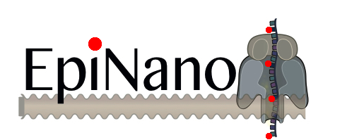

Detection of RNA modifications from Oxford Nanopore direct RNA sequencing reads

## Update
A new and slim version, written in python3 has been  released (version 1.1). You can use this version to prepare the feature table for EpiNano to do training and make predictions. Please check the [Wiki](https://github.com/enovoa/EpiNano/wiki) for additional information on usage.

The code of the previous release (version 1.0), used in our recent paper (Liu, Begik et al., Nature Comm 2019: https://www.nature.com/articles/s41467-019-11713-9), is also still available [here](https://github.com/enovoa/EpiNano/releases).

### Main differences of the new release:
- Faster!
- Uses python3 instead of python2
- Does not extract current intensity in the feature table, as this feature was not used to train the final models

## About EpiNano
EpiNano is a tool to identify RNA modifications present in direct RNA sequencing reads. The current algorithm has been trained and tested on detecting m6A RNA modifications.

EpiNano will extract a set of 'features' from direct RNA sequencing reads, which will be in turn used to predict whether the 'error' is caused by the presence of an RNA modification o r not.
Features extracted include:
- k-mer current intensity
- read quality
- per-base quality
- per-base mismatch frequency
- per-base deletion frequency
- per-base insertion frequency

The software has been trained and tested upon a set of 'unmodified' and 'modified' sequences containing m6A at known sites or A. Its use to detect other RNA modifications has not yet been tested.

### Considerations when using this software

- The algorithm predicts m6A sites. It does not have per-read resolution. We are currently working on an improved version of EpiNano to obtain predictions at per-read level.
- The performance of the algorithm is dependent on the stoichiometry of the site (i.e. sites with very low stoichiometry will be often missed by the algorithm)
- EpiNano relies on the use of base-calling 'errors' to detect RNA modifications; however, direct RNA sequencing base-calling produces a significant amount of 'errors' in unmodified sequences. Therefore, to obtain higher confidence m6A-modified sites, we recommend to sequence both modified and unmodified datasets (e.g. treated with demethylase, or comparing a wild-type vs knockout/knockdown)
- Current trained SVM models will only be accurate if the data has been base-called with Albacore 2.1.7. We are working on training new models for data base-called using Guppy, as well as working on improving the current models by including additional features. If you are using Guppy base-called fast5/fastq, you can still use EpiNano to extract features (i.e. 'errors'), but the SVM predictions (ProbM) will not be accurate.

## What's included
- Scripts to extract features from FAST5 files
- Scripts to process mapped BAM files into kmer pileups (similar to samtools mpileup format but for 5mer sequences)
- Support Vector Machine training (SVM) & testing to predict m6A RNA modifications

## Getting Started and pre-requisites
The following softwares and modules were used by EpiNano

| Software  | Version |
| ------------- | ------------- |
| NanoFilt  | 2.2.0  |
| minimap2  | 2.14-r886  |
| samtools  | 0.1.19  |
| sam2tsv  | a779a30d6af485d9cd669aa3752465132cf21eec   |
| python  | 3.6.7   |
| java openjdk   | 1.8.0    |
| h5py  | 2.8.0    |
| numpy  | 1.15.4     |
| pandas  | 0.23.4        |
| sklearn  | 0.20.2     |

## Download the scripts
git clone git@github.com:enovoa/EpiNano.git 

## Running the software
* Build feature table (on which predictions will be made)

    For step-by-step instructions to build a feature table, please take a look at the [Wiki](https://github.com/enovoa/EpiNano/wiki)

* To train SVM and perform predictions:
```
This step includes SVM training, prediction and performance assessment using single and multiple features.
$ python3 SVM.py -h

Commad:  scripts/SVM.py -h
usage: SVM.py [-h] [-k KERNEL] [-o OUT_PREFIX] [-a] [-M MODEL] [-t TRAIN]
              [-mc MODIFICATION_STATUS_COLUMN] -p PREDICT -cl COLUMNS

optional arguments:
  -h, --help            show this help message and exit
  -k KERNEL, --kernel KERNEL
                        kernel used for training SVM, choose any one from
                        'linear', 'poly', 'rbf', 'sigmoid'; if no choice made,
                        all 4 kernels will be used
  -o OUT_PREFIX, --out_prefix OUT_PREFIX
                        ouput file prefix
  -a, --accuracy_estimation
                        -a perform accuracy estimation with known modified
                        status from --predict file
  -M MODEL, --model MODEL
                        pre-trained model that can ben used for prediction; if
                        this is not available SVM model will be trained and
                        dumped; there can be multiple models, which should be
                        in the same order as kernels applied
  -t TRAIN, --train TRAIN
                        file name of feature table used for training
  -mc MODIFICATION_STATUS_COLUMN, --modification_status_column MODIFICATION_STATUS_COLUMN
                        column number from (input file1, i.e, traing file)
                        that contains modification status information

required arguments:
  -p PREDICT, --predict PREDICT
                        file name of feature table used for making predictions
                        or testing accuracy. when this file is the same the
                        one used for training, half of the data will be chosen
                        for training.
  -cl COLUMNS, --columns COLUMNS
                        comma seperated column number(s) that contain features
                        used for training and prediciton

```                        

### Example

With the example svm input files from example/svm_input folder:

* training with the example feature tables
```
	# the command below will train models using all quality scores are all positions from sample1 and make prediction on sample2
	python3 SVM.py -a -t sample1.csv -p sample2.csv -cl 1-5 -mc 11 -o test

	# while this command will do the same thing except choosing a 'linear' kernel for SVM training
	python3 SVM.py -a -k linear -cl 1-5 -t sample1.csv -p sample2.csv -mc 11

	# this 3rd command uses base quality and mismatch frequencies of the centred bases for SVM training
	python3 SVM.py -t sample1.csv -p sample2.csv -cl 3,7 -mc 11
```
* predict modifications   
```
	#use previously trained model and epinano-scripts-generated site-wise feature table to make predictions
	python3 SVM.py -a -M M6A.mis3.del3.q3.poly.dump -p test.csv -cl 7,12,22 -mc 28 -o pretrained.prediction
```

## Citing this work:
If you find this work useful, please cite:

Huanle Liu, Oguzhan Begik, Morghan Lucas, Jose Miguel Ramirez, Christopher E. Mason, David Wiener, Schraga Schwartz, John S. Mattick, Martin A. Smith and Eva Maria Novoa. Accurate detection of m6A RNA modifications in native RNA sequences . Nature Communications 2019, 10:4079.

Link to paper: https://www.nature.com/articles/s41467-019-11713-9

### License
See LICENSE.md for details

### Contact
Please read the [Wiki](https://github.com/enovoa/EpiNano/wiki) before opening an issue. Also, please go over other [issues](https://github.com/enovoa/EpiNano/issues) that may have been previously resolved (check out "closed" issues).
If you still have doubts/concerns/suggestions, please open a new Issue.
Thanks!
